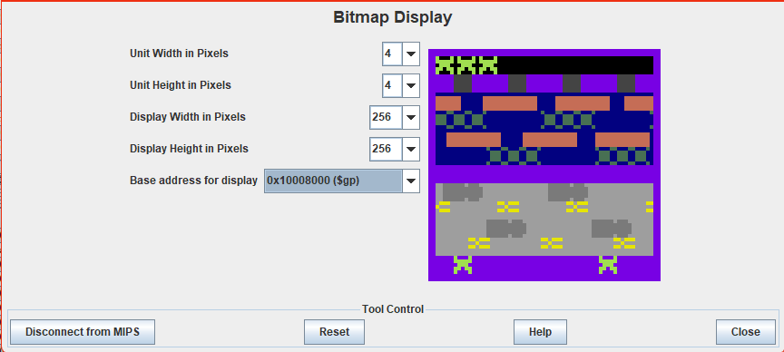

# ProjectFrogger
A simple replica of the arcade game Frogger in Assembly language, with 2p compatibility.

# Bitmap Display Configuration:
# - Unit width in pixels: 4
# - Unit height in pixels: 4
# - Display width in pixels: 256
# - Display height in pixels: 256
# - Base Address for Display: 0x10008000 ($gp)

